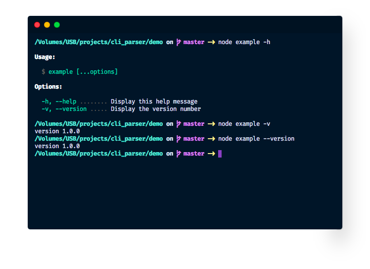

# Tauris
<p align="center">Tauris is an easier way to write CLI tools.</p>

## Table of Contents
- [Motivation](#motivation)
- [Example](#example)
- [API](#api)
  - [Options](#command.option)
  - [Subcommands](#command.command)


## Motivation
There are many, many, probably too many CLI argument parsers out there, but each one of them lacks *something* – whether that's fancy looks or configurability, or whether it just does a bit too much/little *magic*, varies. None of them is perfect.

For example, [yargs](https://npmjs.com/packages/yargs)' subcommand system is, quite honestly, not that good, and the black-and-white UI leaves room for improvement.

**Tauris** is my personal take on what a CLI argument parser/CLI tool should be like.

## Example
A simple example to get you up and running:
```js
const { Command } = require('tauris');

const argv = new Command('example')
  .describe('example command')
  .option('v', {
    alias: [ 'version' ],
    description: 'Display the version number',
    type: 'boolean'
  })
  .demandArgument()
  .parse(process.argv.slice(2));

if (argv) { // `argv` is `false` when a subcommand is invoked
  if (argv.v) console.log('version 1.0.0');
}
```


## API
A short overview of Tauris' API:

### The `Command` Class
The class `Command` is used for both subcommands and your top-level command. The method `parse` takes in `argv` without the binary path and file path. The command's other methods are used to configure it:

#### Command.option
The method `Command.option(name: string[, options: CLIOptionOptions])` configures a new option on the command. The *optional* `options` argument has three properties:
- `alias: string[]` An **array** of aliases
- `description: string` A description to be shown in the help message
- `type: 'text' | 'number' | 'boolean'` Option type
  - `text` The following text will be set as the option value
  - `number` Like `text`, but ignored when the value is non-numeric
  - `boolean` The following value is not counted as part of the option. When the option is set as a flag, it's value will be `true`, else `undefined`.

Returns the command it was invoked on.

#### Command.describe
The method `Command.describe(message: string)` adds a description to the command. This will be displayed in the help message *if the command is a subcommand*. 

Returns the command it was invoked on.

#### Command.command
The method `Command.command(command: Command)` adds a **subcommand** (!!) to the Command. This subcommand is simply another instance of the `Command` class.

Returns the command it was invoked on.

#### Command.handler
When the `Command` is intended to be used as a **subcommand**, call this method to add a handler that will be called when the subcommand is invoked.

Signature: `Command.handler(((argv: { [key: string]: any }) => void)): Command`

Returns the command it was invoked on.

#### Command.demandArgument
Call this method to enforce that at least one option *or* subcommand *or* parameter must be passed and otherwise show a help message.

Returns the command it was invoked on.

#### Command.header
A message displayed above the help message.

Signature: `Command.header(message: string): Command`

Returns the command it was invoked on.

#### Command.usage
Override the usage message.

Signature: `Command.usage(message: string): Command`

Return the command it was invoked on.

#### Command.noHelp
Disable the help message.

Signature: `Command.usage(): Command`

Returns the command it was invoked on.

#### Command.parse
The method `parse` takes in `argv` without the binary path and file path.

<br/>

Signature: `Command.parse(argv: string[]): { [key: string]: any }`

Example: `... .parse(process.argv.slice(2))`

<br/>

Returns the parsed arguments.